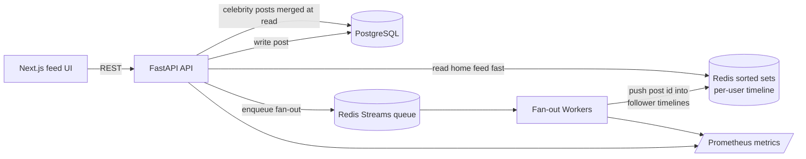
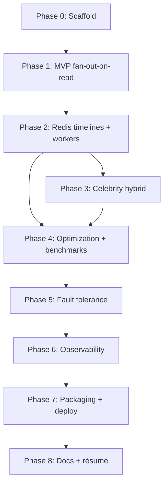

# Social Feed Service — Implementation Plan

A "mini Twitter/X timeline": users post, followers see those posts in a home feed that
loads fast even when someone has millions of followers. The backend is the star; the
frontend is a thin feed UI.

This plan is **iterative on purpose**. We first build a *correct but naive* product
(Phase 1), then we measure it and progressively replace the slow parts with the
"impressive" infrastructure (Redis timelines, background fan-out workers, the celebrity
hybrid, optimization, fault tolerance, observability). Each phase ends with a working,
demoable system — never a half-broken one.

> Golden rule: **never build the next phase until the current one runs end-to-end and is
> committed.** Working software at every step.

---

## Target keywords this project demonstrates

`distributed systems` · `scalability` · `low latency` · `background workers` ·
`microservices` · `queues` · `Redis` · `fault tolerant` · `optimization` ·
`high throughput` · `caching`

Each phase below notes which keywords it unlocks and the résumé bullet it earns.

---

## Tech stack

| Layer | Choice | Notes |
|---|---|---|
| Web API | **FastAPI** (async) | low-latency, OpenAPI docs, async Redis/DB calls |
| Source of truth | **PostgreSQL** | users, follow graph, posts |
| Cache / timelines | **Redis** (sorted sets) | per-user home timelines |
| Queue | **Redis Streams** | fan-out jobs (consumer groups) |
| Background workers | **Custom async worker** | the fan-out engine (separate process) |
| Frontend | **Next.js** | thin feed UI |
| Local infra | **Docker Compose** | one-command full stack |
| Tests | **pytest + httpx** | unit + integration |
| Observability | **Prometheus + Grafana** | added in a later phase |

---

## High-level target architecture (end state)



We do **not** build all of this at once. We arrive here by the end of Phase 6.

---

## Data model (Postgres)

```text
users
  id            BIGSERIAL PK
  username      TEXT UNIQUE NOT NULL
  display_name  TEXT
  created_at    TIMESTAMPTZ DEFAULT now()

follows
  follower_id   BIGINT FK -> users.id
  followee_id   BIGINT FK -> users.id
  created_at    TIMESTAMPTZ DEFAULT now()
  PRIMARY KEY (follower_id, followee_id)

posts
  id            BIGSERIAL PK
  author_id     BIGINT FK -> users.id
  content       TEXT NOT NULL
  created_at    TIMESTAMPTZ DEFAULT now()
  -- index: (author_id, id DESC)
```

### Redis keys (introduced Phase 2+)

```text
timeline:{user_id}   -> ZSET  member=post_id  score=post_id (or created_at epoch)
feed_stream          -> STREAM of fan-out jobs {post_id, author_id}
user:{id}:followers  -> (optional) cached follower count
```

---

## Core API surface (grows over phases)

| Method | Path | Phase | Purpose |
|---|---|---|---|
| POST | `/users` | 1 | create a user |
| POST | `/follow` | 1 | follow a user |
| DELETE | `/follow` | 1 | unfollow |
| POST | `/posts` | 1 | create a post |
| GET | `/feed` | 1 | home timeline (cursor paginated) |
| GET | `/users/{id}/posts` | 1 | a user's own posts |
| GET | `/healthz` | 0 | health check |
| GET | `/metrics` | 6 | Prometheus metrics |

---

# Phases

## Phase 0 — Project scaffolding
**Goal:** a skeleton that boots, connects to Postgres + Redis, and returns `/healthz`.

**Tasks**
- Repo layout: `app/` (FastAPI), `worker/`, `frontend/`, `docker-compose.yml`, `.env`.
- Docker Compose with `postgres` and `redis` services.
- FastAPI app with config loading and a `/healthz` endpoint that pings DB + Redis.
- DB migration tooling (Alembic) and the schema above.
- README "how to run" + Makefile (`make up`, `make test`, `make bench`).

**Definition of done**
- `docker compose up` starts API + Postgres + Redis.
- `GET /healthz` returns 200 with DB + Redis status.

**Keywords unlocked:** project hygiene only.

---

## Phase 1 — MVP: the product actually works (naive fan-out-on-read)
**Goal:** a fully working social feed with the *simplest correct* design — **no Redis
timelines, no workers yet.** The home feed is built by querying Postgres directly.

> Why naive first: this gives us a correct baseline to demo and to **benchmark**, so the
> later optimizations have real before/after numbers. This "I started simple, measured,
> then optimized" story is gold in interviews.

**Tasks**
- Users: create user, basic lookup. (Auth can be a simple API key / fake `X-User-Id`
  header for now — real auth is not the point of this project.)
- Follow / unfollow endpoints writing to the `follows` table.
- Create post endpoint writing to `posts`.
- **Home feed (`GET /feed`)** = SQL:
  `SELECT posts of everyone current_user follows, ORDER BY id DESC, cursor paginated.`
- User's own posts endpoint.
- Minimal Next.js UI: login-as-user selector, compose box, feed list, follow button.
- Seed script that creates N users, a follow graph, and some posts.

**Definition of done**
- I can: create users, follow people, post, and see a correct home feed in the browser.
- Cursor pagination works.
- Everything runs via Docker Compose.

**This is the most important milestone — the product is real.**

**Keywords unlocked:** `REST API`, `PostgreSQL`, basic backend.
**Résumé bullet (draft):** "Built a social feed service (FastAPI + PostgreSQL) with
follow graph, posting, and cursor-paginated home timeline."

---

## Phase 2 — Redis timelines + background fan-out workers
**Goal:** replace fan-out-on-read with **fan-out-on-write**: precompute each user's home
timeline in Redis so feed reads are O(1) cache hits. Introduce the **queue + worker**.

**Tasks**
- Add Redis sorted set `timeline:{user_id}` (member = post_id, score = post_id).
- On `POST /posts`: write to Postgres, then **enqueue a fan-out job** to a Redis Stream
  instead of doing work inline.
- New **worker process** (separate container): consumes the stream via a consumer group,
  loads the author's followers, and pushes the new post_id into each follower's
  `timeline:` ZSET (use Redis pipelining for the batch).
- `GET /feed` now reads from `timeline:{current_user}` (ZREVRANGE) and hydrates post
  bodies from Postgres (or a post cache).
- Trim timelines to the latest ~800 entries (ZREMRANGEBYRANK) to bound memory.
- **Cache-miss fallback:** if a timeline is empty/missing, rebuild it from Postgres
  on the fly (keeps correctness while cache warms).

**Definition of done**
- Posting a message causes it to appear in all followers' feeds within ~1s.
- Feed reads hit Redis, not the heavy SQL join.
- Worker runs as its own process; killing/restarting it doesn't lose posts (they remain
  in the stream until acked).

**Keywords unlocked:** `Redis`, `queues`, `background workers`, `caching`,
`microservices` (API and worker are now separate services).
**Résumé bullet (draft):** "Implemented fan-out-on-write using Redis sorted-set timelines
and a Redis Streams queue consumed by async background workers, turning feed reads into
O(1) cache hits."

---

## Phase 3 — The celebrity problem (hybrid fan-out)
**Goal:** solve the scalability flaw of pure fan-out-on-write: a user with millions of
followers would trigger millions of writes per post. Switch to a **hybrid** model.

**Tasks**
- Define a "celebrity" threshold (e.g. > 10k followers) — store/lookup follower counts.
- On post by a **normal** user → fan-out-on-write (Phase 2 behavior).
- On post by a **celebrity** → **skip** fan-out; do nothing to follower timelines.
- On `GET /feed` → merge two sources:
  1. the precomputed `timeline:` ZSET (normal authors), plus
  2. recent posts from the **celebrities this user follows**, fetched at read time,
  3. merge-sort the two by time, paginate.
- Cache each celebrity's recent posts in Redis so the read-time merge is cheap.

**Definition of done**
- A celebrity posting does **not** cause a fan-out storm.
- A user following both normal users and celebrities sees a correct, time-ordered feed.

**Keywords unlocked:** `scalability`, `distributed systems`, system-design depth.
**Résumé bullet (draft):** "Designed a hybrid fan-out model (write-fan-out for normal
users, read-time merge for high-follower 'celebrity' accounts) to avoid fan-out storms,
the classic Twitter timeline scalability problem."

---

## Phase 4 — Optimization & performance (make it fast, prove it)
**Goal:** drive latency down and throughput up, with **measured before/after numbers**.

**Tasks**
- Cursor-based pagination everywhere (no OFFSET).
- Redis pipelining / `MGET` for batch post hydration; consider a `post:{id}` cache.
- Batch fan-out writes per follower chunk; tune worker concurrency and batch size.
- DB indexing pass (`posts(author_id, id desc)`, `follows(follower_id)`), `EXPLAIN ANALYZE`.
- Connection pooling (asyncpg pool, Redis pool) tuned.
- Load test with a script (locust or custom asyncio) at increasing concurrency.
- **Record metrics**: feed read p50/p95/p99, post-to-visible latency, throughput
  (posts/sec, feeds/sec). Compare Phase 1 (read) vs Phase 2/3 (write) designs.
- Put a results table + chart in the README.

**Definition of done**
- Documented numbers, e.g. "feed read p99 < 100 ms at X RPS", "post-to-feed < 1s".
- A clear before/after comparison vs the naive Phase 1 baseline.

**Keywords unlocked:** `low latency`, `optimization`, `high throughput`, `caching`.
**Résumé bullet (draft):** "Optimized feed read p99 from ~Xms to <100ms via Redis
sorted-set caching, pipelined batch hydration, and indexed cursor pagination; sustained
N feed reads/sec under load."

---

## Phase 5 — Fault tolerance & reliability
**Goal:** guarantee no lost posts and graceful recovery from failures.

**Tasks**
- Worker: at-least-once processing with Redis Streams consumer-group acks; reclaim
  pending (unacked) messages from dead workers (`XAUTOCLAIM`).
- Retries with exponential backoff; a **dead-letter stream** for poison jobs.
- Idempotent fan-out (re-processing a job must not duplicate timeline entries — ZADD by
  post_id is naturally idempotent; verify).
- Timeline rebuild path: if Redis is flushed/unavailable, feeds fall back to Postgres and
  rebuild caches (degraded but correct).
- Graceful shutdown (drain in-flight jobs, ack before exit).
- Chaos test: kill a worker mid-fan-out and assert no post is lost or duplicated.

**Definition of done**
- Killing a worker mid-job loses zero posts and creates zero duplicates.
- Redis outage degrades to DB reads instead of erroring.

**Keywords unlocked:** `fault tolerant`, `distributed systems`, `reliability`.
**Résumé bullet (draft):** "Built at-least-once, idempotent fan-out with consumer-group
acks, dead-letter handling, and crash recovery (XAUTOCLAIM); verified zero data loss
under worker-kill chaos tests."

---

## Phase 6 — Observability
**Goal:** make the system measurable and debuggable like a production service.

**Tasks**
- Prometheus client: request latency histograms, feed read latency, fan-out lag
  (post-created → timeline-updated), queue depth, worker throughput, cache hit ratio.
- `/metrics` endpoint on API and worker.
- Grafana dashboard (pre-provisioned via Docker Compose) with the key panels.
- Structured JSON logging with request IDs.

**Definition of done**
- `docker compose up` brings up Grafana with a working dashboard.
- I can watch fan-out lag and queue depth move under load.

**Keywords unlocked:** `observability`, `monitoring`.
**Résumé bullet (draft):** "Instrumented the platform with Prometheus/Grafana (feed
latency, fan-out lag, queue depth, cache hit ratio), cutting issue diagnosis to minutes."

---

## Phase 7 — Packaging, microservices split & deployment
**Goal:** present it as a clean, multi-service, reproducible system.

**Tasks**
- Clear service boundaries: `api`, `fanout-worker`, `frontend`, plus `postgres`, `redis`,
  `prometheus`, `grafana` — all in one Docker Compose.
- Independent scaling note: `docker compose up --scale fanout-worker=4`.
- GitHub Actions CI: lint (ruff) + type-check (mypy/pyright) + pytest on every push.
- Optional stretch: Kubernetes manifests / Helm chart; deploy a live demo (frontend on
  Vercel, backend on a small VM or Fly.io/Render).

**Definition of done**
- One command runs the whole system; workers scale horizontally.
- CI is green on the repo.

**Keywords unlocked:** `microservices`, `containerization`, `CI/CD`, `Kubernetes` (stretch).

---

## Phase 8 — Documentation & résumé assets
**Goal:** turn the working system into something that actually lands interviews.

**Tasks**
- `README.md`: what it is, architecture diagram, how to run, **benchmark results + chart**.
- `DESIGN.md`: 4–6 key decisions and the alternatives rejected — fan-out-on-read vs
  -on-write vs hybrid, why Redis sorted sets, why Redis Streams over Celery, consistency
  tradeoffs, celebrity threshold tuning.
- One **blog post** on an interesting subproblem (the celebrity fan-out, or the
  at-least-once worker), to share for visibility/referrals.
- Finalize 3–4 résumé bullets with real measured numbers.

**Definition of done**
- A stranger can clone the repo, run it, read the design doc, and understand the tradeoffs.

---

## Phase dependency / sequence



## Minimum résumé-worthy stopping points
- **Stop after Phase 4**: already a strong project (working feed, Redis fan-out, celebrity
  hybrid, real benchmarks).
- **Stop after Phase 6**: portfolio-grade (fault tolerance + observability added).
- **Through Phase 8**: genuinely interview-defensible, FAANG-tier portfolio material.

## Stretch goals (only after Phase 8)
- Real auth (JWT), rate limiting per user.
- Likes / counters (Redis), trending posts.
- WebSocket live feed updates (Redis pub/sub).
- Read replicas / sharding the timeline cache across Redis nodes.
