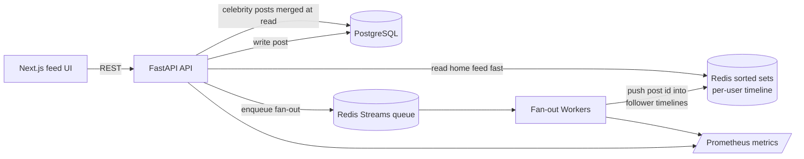
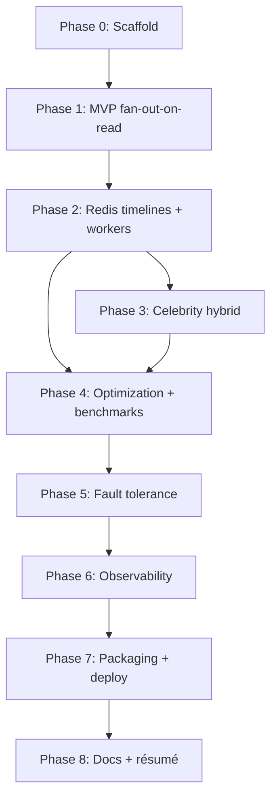

# Social Feed Service — Implementation Plan

A "mini Twitter/X timeline": users post, followers see those posts in a home feed that
loads fast even when someone has millions of followers. The backend is the star, but it is
also a **real, usable product**: users register and log in (real JWT auth), and a lightweight
Next.js UI lets them post, follow, and read their feed.

This plan is **iterative on purpose**. We first build a *correct but naive* product
(Phase 1), then we measure it and progressively replace the slow parts with the
"impressive" infrastructure (Redis timelines, background fan-out workers, the celebrity
hybrid, optimization, fault tolerance, observability). Each phase ends with a working,
demoable system — never a half-broken one.

> Golden rule: **never build the next phase until the current one runs end-to-end and is
> committed.** Working software at every step.

---

## Implementation status (live tracker)

> Updated: 2026-06-29 — Legend: **Done** / **In progress** / **Not started** / **Deferred**

| Phase | Status | Notes |
|---|---|---|
| 0 — Scaffolding | In progress (core done) | Postgres + `/healthz` live; Redis/Alembic/README deferred until needed |
| 1 — MVP + auth (fan-out-on-read) | Done | 1.1–1.15 complete: full product + likes/comments + integration tests (41 passing) |
| 2 — Redis timelines + workers | Done | 2.1–2.6 complete: Redis-backed feed, fan-out worker + enqueue on write, timeline trimming |
| 3 — Celebrity hybrid | Done | 3.1–3.4 complete: hybrid fan-out (classify, skip fan-out, cache, read-time merge) |
| 4 — Optimization + benchmarks | Not started | |
| 5 — Fault tolerance | Not started | |
| 6 — Observability | Not started | |
| 7 — Packaging + deploy | Not started | |
| 8 — Docs + résumé | Not started | |

### Deliberate deviations from the original plan
- **Redis is deferred to Phase 2** (where it is first used) instead of Phase 0, to keep each
  step minimal. The Phase 0 compose currently runs **Postgres only**.
- **Alembic migrations + schema** will be added at the **start of Phase 1**, when the first
  tables are actually needed.
- Dev model: the **API runs in a local venv**; **Postgres runs in Docker**. Containerising the
  API itself is a Phase 7 packaging concern.
- **Real auth promoted into Phase 1** (was a Phase 8 stretch). The app is a usable, user-facing
  product: `current_user` validates a **JWT bearer token** (bcrypt-hashed passwords); the fake
  `X-User-Id` placeholder is dropped.
- **Email-based accounts**: registration takes **email + password** (email is the login
  identifier); the **username is optional and set after registration** via `PATCH /users/me`.
- **Hardening pass (post-1.9):** register/username conflicts return **409** (IntegrityError-safe); passwords truncated to bcrypt's 72-byte limit; feed avoids empty last page (`limit+1`); CORS origins via `settings.cors_origins`; `GET /users/{id}` now requires auth; `requirements.txt` version-pinned; frontend redirects authed users away from login/register; seed staggers timestamps.

### Phase 0 checklist
- [x] Repo layout (`backend/app`, `frontend/`, `docker-compose.yml`, `.env`)
- [x] Docker Compose — **Postgres** service (healthcheck + named volume)
- [x] FastAPI app with config loading + `/healthz` pinging Postgres
- [x] Secret hygiene — real creds only in git-ignored `backend/.env`; committed files use placeholders
- [x] Root `.gitignore` (Python) + `.vscode/settings.json` pointing at the venv interpreter
- [x] Redis service — **done in Phase 2.1** (compose + async client + `/healthz` ping)
- [x] Alembic migrations + schema — **done in Phase 1.1**
- [ ] README "how to run" + Makefile — **deferred**

**Phase 0 Definition of Done:** `docker compose up` starts Postgres — done; `GET /healthz`
returns `{"status":"ok","postgres":"up"}` — done. (The Redis portion of the DoD moves to Phase 2.)

### Current state snapshot (files)
- `backend/app/main.py` — FastAPI app; CORS for the frontend; `/healthz` pings Postgres + Redis; includes auth/users/follows/posts/feed routers; lifespan disposes the engine + Redis client
- `backend/app/config.py` — pydantic-settings; required `DATABASE_URL` + `JWT_SECRET_KEY` (+ `redis_url`, `timeline_max_size`/`timeline_ttl_seconds`, `celebrity_threshold`, `jwt_algorithm`, `access_token_expire_minutes`, `cors_origins`)
- `backend/app/redis_client.py` — shared async Redis client (`redis.asyncio`, `decode_responses=True`) + `get_redis` dependency [2.1]
- `backend/app/db.py` — async SQLAlchemy engine + `async_sessionmaker` + `get_session()` dependency
- `backend/app/models.py` — SQLAlchemy models (`Base`): `users` (`email` + nullable `username` + `password_hash`), `follows`, `posts`, `likes`
- `backend/app/security.py` — bcrypt password hashing + JWT encode/decode
- `backend/app/deps.py` — `current_user` dependency (validates the JWT bearer token)
- `backend/app/schemas/user.py` — `UserOut` (public), `MeOut` (+ email), `ProfileUpdate`; `backend/app/schemas/auth.py` — email register/login/token DTOs (`EmailStr`)
- `backend/app/services/auth.py` — auth logic (create by email, authenticate by email, update profile)
- `backend/app/services/users.py` — `get_user_by_id`, `search_users`, follower/following counts, `is_following`
- `backend/app/services/follows.py` — follow/unfollow (idempotent, race-safe upsert; return whether a row actually changed)
- `backend/app/services/celebrities.py` — O(1) celebrity classification: cached follower count `user:{id}:followers` (backfilled from Postgres on miss, maintained on follow/unfollow), `is_celebrity` vs `celebrity_threshold`; recent-posts cache `celebrity:{id}:posts` ZSET (`add_recent_post`/`get_recent_post_ids`, backfilled on miss) [3.1/3.3]
- `backend/app/services/posts.py` — create post, list a user's posts (newest-first)
- `backend/app/services/feed.py` — hybrid home feed: merges the Redis timeline ZSET (own + **normal** followees, rebuild-on-miss/TTL) with followed celebrities' cached recent posts at read time (`get_feed_page`), keyset-paginated by post id; post hydration by id (author eager-loaded)
- `backend/app/services/fanout.py` — fan-out: `enqueue_post` (`XADD feed_stream`) + `fan_out_post` (push post id into followers' + author's **materialized** timelines only) [2.4/2.5]
- `backend/worker/main.py` — fan-out worker (separate venv process); consumer group on `feed_stream`, `XREADGROUP`/`XACK`, calls `fan_out_post`; run `python -m worker.main` [2.4]
- `backend/app/routers/auth.py` — `POST /auth/register`, `POST /auth/login` (email); `backend/app/routers/users.py` — `GET /users/me`, `PATCH /users/me`, `GET /users/search`, `GET /users/{id}`, `GET /users/by-username/{username}` (profile + counts); `backend/app/routers/follows.py` — `POST`/`DELETE /follow`; `backend/app/routers/posts.py` — `POST /posts` (enqueues fan-out), `GET /posts/{id}` (detail + author + likes), `GET /users/{id}/posts` (enriched, auth), `POST`/`DELETE /posts/{id}/like`, `GET`/`POST /posts/{id}/comments`; `backend/app/routers/feed.py` — `GET /feed` (Redis timeline; items include author + like/comment counts)
- `backend/scripts/seed.py` — demo data generator (N users, random follow graph, posts; `python -m scripts.seed`); `backend/scripts/unseed.py` — removes seeded users (`python -m scripts.unseed`)
- `backend/alembic/` + `alembic.ini` — Alembic (async); migrations: `dcfce07fa8f2` (schema), `30f2d801d8cb` (password_hash), `53dcc349a3d9` (email + nullable username), `0be43df3a9c7` (likes), `80080e70e043` (comments)
- `backend/requirements.txt` — fastapi, uvicorn[standard], sqlalchemy[asyncio], asyncpg, pydantic-settings, alembic, bcrypt, pyjwt, email-validator (version-pinned); test deps pytest, pytest-asyncio, httpx
- `backend/tests/` + `pytest.ini` — pytest + httpx integration suite (conftest fixtures + 7 modules, 41 tests); runs against an auto-created `<db>_test` database with per-test schema rebuild
- `docker-compose.yml` — `postgres:16-alpine` + `redis:7-alpine` (appendonly, named volumes), `env_file: backend/.env`, healthchecks
- `frontend/` — Next.js app: `lib/api.ts` (typed client), `lib/auth.tsx` (auth context); `app/login`, `app/register`; route group `app/(app)/` (Home/Explore/Profile/Settings/`p/[id]` post detail) with sidebar; `components/` (Sidebar/PostCard/Composer/FollowButton/UserCard/LikeButton/Avatar); `.env.local` sets `NEXT_PUBLIC_API_BASE_URL`

---

## Target keywords this project demonstrates

`distributed systems` · `scalability` · `low latency` · `background workers` ·
`microservices` · `queues` · `Redis` · `fault tolerant` · `optimization` ·
`high throughput` · `caching`

Each phase below notes which keywords it unlocks and the résumé bullet it earns.

---

## Tech stack

| Layer | Choice | Notes |
|---|---|---|
| Web API | **FastAPI** (async) | low-latency, OpenAPI docs, async Redis/DB calls |
| Auth | **JWT bearer** + bcrypt hashing | real register/login; isolated behind `current_user` |
| Source of truth | **PostgreSQL** | users, follow graph, posts |
| Cache / timelines | **Redis** (sorted sets) | per-user home timelines |
| Queue | **Redis Streams** | fan-out jobs (consumer groups) |
| Background workers | **Custom async worker** | the fan-out engine (separate process) |
| Frontend | **Next.js** | feed UI + auth screens (lightweight but usable) |
| Local infra | **Docker Compose** | one-command full stack |
| Tests | **pytest + httpx** | unit + integration |
| Observability | **Prometheus + Grafana** | added in a later phase |

---

## High-level target architecture (end state)



We do **not** build all of this at once. We arrive here by the end of Phase 6.

---

## Project structure (folder layout)

A conventional, layered FastAPI layout that grows with the phases. Items marked **[Pn]** are
introduced in that phase; everything else exists today. We create each folder **only when its
phase needs it** — no empty scaffolding up front.

```text
ripple/
├─ docker-compose.yml             # local infra (Postgres now; Redis + others later)
├─ .gitignore   .vscode/          # Python ignores + venv interpreter setting
├─ context/PLAN.md                # this plan / live tracker
├─ frontend/                      # Next.js feed UI + auth screens             [built in 1.9]
└─ backend/
   ├─ .env  .env.example          # real secrets (git-ignored) + placeholder template
   ├─ requirements.txt
   ├─ alembic.ini   alembic/      # migrations; env.py injects URL from .env
   │  └─ versions/                # migration scripts (dcfce07fa8f2 = initial schema)
   ├─ app/
   │  ├─ main.py                  # FastAPI app: lifespan, router includes, /healthz
   │  ├─ config.py                # pydantic-settings (DATABASE_URL, ...)
   │  ├─ db.py                    # async engine + session + get_session dependency
   │  ├─ models.py                # SQLAlchemy ORM models (users/follows/posts)
   │  ├─ deps.py                  # shared deps: current_user via JWT bearer token  [1.2]
   │  ├─ security.py              # bcrypt password hashing + JWT encode/decode      [1.2]
   │  ├─ schemas/                 # Pydantic request/response DTOs              [1.2+]
   │  │   └─ auth.py  user.py  follow.py  post.py  feed.py
   │  ├─ routers/                 # thin HTTP layer, one module per resource    [1.2+]
   │  │   └─ auth.py  users.py  follows.py  posts.py  feed.py
   │  ├─ services/                # business logic / DB queries (feed assembly) [1.3+]
   │  │   └─ auth.py  users.py  follows.py  posts.py  feed.py
   │  └─ redis_client.py          # shared async Redis client                   [2.1]
   ├─ worker/                     # fan-out worker (separate process)           [2.4]
   │   └─ main.py
   ├─ scripts/
   │   └─ seed.py                 # demo data generator                         [1.8]
   └─ tests/                      # pytest + httpx integration tests            [1.10]
```

### Layered request flow

```text
HTTP request → router (validate via schema) → service (business logic) → model/ORM → Postgres
                                                                       ↘ response ← schema
```

Keeping these layers separate is the whole point: later phases can swap the feed's data source
(Postgres join → Redis timelines) by changing only the **service** layer, leaving routers and
schemas untouched.

- **routers/** — URL + verb wiring, status codes, dependency injection; no SQL.
- **schemas/** — request validation + response shape (decoupled from ORM models).
- **services/** — the actual work: queries, follow-graph writes, feed assembly, later fan-out + cache reads.
- **models.py** — SQLAlchemy tables; the source of truth for Alembic migrations.
- **deps.py** — cross-cutting dependencies (DB session, current user, later the Redis client).
- **worker/** + **redis_client.py** — the async infrastructure introduced from Phase 2 on.

### Current vs target
Today the backend is intentionally minimal: `app/{main,config,db,models}.py` + `alembic/`.
The auth foundation (`deps.py`, `security.py`), `schemas/`, `routers/`, and `services/` layers
land across **1.2–1.7**; `scripts/`, `tests/`, `worker/`, and `redis_client.py` follow in their
marked phases.

---

## Data model (Postgres)

```text
users
  id            BIGSERIAL PK
  email         TEXT UNIQUE NOT NULL       -- login identifier (added 1.3)
  username      TEXT UNIQUE                -- nullable; set after registration (1.3)
  display_name  TEXT
  password_hash TEXT NOT NULL              -- bcrypt; added by the auth migration (1.2)
  created_at    TIMESTAMPTZ DEFAULT now()

follows
  follower_id   BIGINT FK -> users.id
  followee_id   BIGINT FK -> users.id
  created_at    TIMESTAMPTZ DEFAULT now()
  PRIMARY KEY (follower_id, followee_id)

posts
  id            BIGSERIAL PK
  author_id     BIGINT FK -> users.id
  content       TEXT NOT NULL
  created_at    TIMESTAMPTZ DEFAULT now()
  -- index: (author_id, id DESC)

likes                              -- [1.12]
  user_id       BIGINT FK -> users.id
  post_id       BIGINT FK -> posts.id
  created_at    TIMESTAMPTZ DEFAULT now()
  PRIMARY KEY (user_id, post_id)

comments                           -- [1.14]
  id            BIGSERIAL PK
  post_id       BIGINT FK -> posts.id
  author_id     BIGINT FK -> users.id
  content       TEXT NOT NULL
  created_at    TIMESTAMPTZ DEFAULT now()
  -- index: (post_id, id)
```

### Redis keys (introduced Phase 2+)

```text
timeline:{user_id}   -> ZSET  member=post_id  score=post_id (or created_at epoch)
feed_stream          -> STREAM of fan-out jobs {post_id, author_id}
user:{id}:followers  -> (optional) cached follower count
```

---

## Core API surface (grows over phases)

| Method | Path | Phase | Purpose |
|---|---|---|---|
| POST | `/auth/register` | 1 | register (email + password) |
| POST | `/auth/login` | 1 | log in (email), returns a JWT |
| GET | `/users/me` | 1 | current authenticated user |
| PATCH | `/users/me` | 1 | set username / update profile |
| GET | `/users/search` | 1 | search users (with follow state) |
| GET | `/users/by-username/{u}` | 1 | profile (counts + follow state) |
| POST | `/follow` | 1 | follow a user |
| DELETE | `/follow` | 1 | unfollow |
| POST | `/posts` | 1 | create a post |
| GET | `/posts/{id}` | 1 | single post (counts + liked) |
| POST | `/posts/{id}/like` | 1 | like a post |
| DELETE | `/posts/{id}/like` | 1 | unlike |
| GET | `/posts/{id}/comments` | 1 | list comments |
| POST | `/posts/{id}/comments` | 1 | add comment |
| GET | `/feed` | 1 | home timeline (cursor paginated) |
| GET | `/users/{id}/posts` | 1 | a user's own posts |
| GET | `/healthz` | 0 | health check |
| GET | `/metrics` | 6 | Prometheus metrics |

---

# Phases

## Phase 0 — Project scaffolding
**Goal:** a skeleton that boots, connects to Postgres + Redis, and returns `/healthz`.

**Status:** Core done (Postgres path). Redis / Alembic / README deferred — see deviations above.

**Sub-phases** (each an independent, self-contained chunk)
- **0.1 — Repo layout** — `backend/app/` (FastAPI), `frontend/`, `docker-compose.yml`, `.env`. **[FIXED]** (`worker/` arrives at 2.4.)
- **0.2 — Docker Compose (Postgres)** — `postgres:16-alpine` with healthcheck + named volume. **[FIXED — Postgres only]**
- **0.3 — Config + DB engine** — `config.py` (pydantic-settings, required `DATABASE_URL`) + `db.py` (async SQLAlchemy engine/session). **[FIXED]**
- **0.4 — Health check** — `/healthz` pings Postgres and reports status. **[FIXED — Postgres only]** (Redis ping moves to 2.1.)
- **0.5 — Secret hygiene & dev tooling** — real creds only in git-ignored `backend/.env`; root `.gitignore`; `.vscode` interpreter → venv. **[FIXED]**
- **0.6 — Redis service** — add `redis` to compose + client + healthz ping. **[DEFERRED → 2.1]**
- **0.7 — Alembic + schema** — migration tooling and the data-model tables. **[DEFERRED → 1.1]**
- **0.8 — README + Makefile** — "how to run" + `make up/test/bench`. **[DEFERRED → Phase 8 / as needed]**

**Definition of done**
- **[FIXED — Postgres]** `docker compose up` starts Postgres. (API runs in the venv; Redis is added in Phase 2.)
- **[FIXED — Postgres]** `GET /healthz` returns 200 with DB status — `{"status":"ok","postgres":"up"}`.

**Keywords unlocked:** project hygiene only.

---

## Phase 1 — MVP: the product actually works (naive fan-out-on-read)
**Goal:** a fully working social feed with the *simplest correct* design — **no Redis
timelines, no workers yet.** The home feed is built by querying Postgres directly.

**Status:** Done — 1.1–1.9 done (backend + Next.js UI: register/login/feed/compose/follow); hardening pass done (409 conflicts, bcrypt 72-byte cap, feed pagination, CORS config, pinned deps); UI polish (Inter font + avatars) done; likes done (1.12); post detail done (1.13); comments done (1.14); integration tests green (1.15 — 41 pytest+httpx tests). Phase 1 complete; ready for Phase 2.

> Why naive first: this gives us a correct baseline to demo and to **benchmark**, so the
> later optimizations have real before/after numbers. This "I started simple, measured,
> then optimized" story is gold in interviews.

**Sub-phases** (each an independent, self-contained chunk)
- **1.1 — Schema + migrations** — SQLAlchemy models for `users`, `follows`, `posts` (per data model) + Alembic setup and the initial migration. _Done when:_ `alembic upgrade head` creates all three tables. _(This is the deferred 0.7.)_ **[DONE]**
- **1.2 — Auth foundation + app skeleton** — routers package, `get_session` dependency, `security.py` (bcrypt hashing + JWT encode/decode), a migration adding `users.password_hash`, and the `current_user` dependency that validates a **JWT bearer token**. _Done when:_ a protected route resolves the caller from a valid token (401 otherwise). _(Delivered: `security.py`, `deps.current_user`, `schemas/user.py`, `routers/users.py` with protected `GET /users/me`, migration `30f2d801d8cb`.)_ **[DONE]**
- **1.3 — Auth API** — `POST /auth/register` (**email + password**, hashed) and `POST /auth/login` (**email**-based, returns a JWT); `PATCH /users/me` sets the username after registration. _Done when:_ a user can register, log in, and set their username. _(Delivered: `schemas/auth.py` (EmailStr), `services/auth.py`, `routers/auth.py`, `routers/users.py` `PATCH /me`; migration `53dcc349a3d9` adds `email` + nullable `username`; handles 201 / 409 / 401.)_ **[DONE]**
- **1.4 — Users lookup** — `GET /users/{id}` (public profile) with Pydantic schemas. _Done when:_ a profile can be fetched. _(Delivered: `services/users.py` `get_user_by_id`, `routers/users.py` `GET /{id}` → `UserOut` (email hidden), 404 when missing; `/me` keeps precedence.)_ **[DONE]**
- **1.5 — Follow graph** — `POST /follow` and `DELETE /follow` writing/removing rows in `follows` (idempotent, no self-follow; actor = current user). _Done when:_ follow/unfollow persist correctly. _(Delivered: `schemas/follow.py`, `services/follows.py` (race-safe `ON CONFLICT DO NOTHING`), `routers/follows.py`; 400 self-follow, 404 missing target, idempotent.)_ **[DONE]**
- **1.6 — Posts API** — `POST /posts` (author = current user) and `GET /users/{id}/posts` (author timeline, newest first). _Done when:_ posting and reading a user's posts work. _(Delivered: `schemas/post.py` (content 1–280), `services/posts.py`, `routers/posts.py`; 201 create, newest-first list, 404 missing author, 401 unauth, 422 empty.)_ **[DONE]**
- **1.7 — Home feed (fan-out-on-read)** — `GET /feed`: SQL query of posts from everyone the current user follows **plus their own posts**, `ORDER BY id DESC`, **cursor** paginated (`?cursor=&limit=`). _Done when:_ feed is correct and pagination is stable. _(Delivered: `services/feed.py` (own + followees via subquery, keyset cursor `id < cursor`), `schemas/feed.py` (`FeedPage{items,next_cursor}`), `routers/feed.py`; excludes non-followed authors; 401 unauth.)_ **[DONE]**
- **1.8 — Seed script** — generate N users (with passwords), a random follow graph, and posts for local testing/benchmarking. _Done when:_ one command populates a demo dataset. _(Delivered: `scripts/seed.py` — `python -m scripts.seed [--users --posts --follows]`; idempotent (clears `seeduser*@example.com` first), shared bcrypt hash; default 20 users / 100 posts / 100 follows.)_ **[DONE]**
- **1.9 — Frontend UI (Next.js)** — register/login screens, then compose box, feed list, follow button — lightweight but usable, authenticating with the JWT. _Done when:_ the full loop works in the browser. _(Delivered: typed client + JWT in localStorage; auth screens; **multi-page Twitter-style app** — route group `app/(app)/` with a sidebar (Home / Explore / Profile / Settings), `components/` (Sidebar/PostCard/Composer/FollowButton/UserCard), `lib/auth.tsx` auth context. Backend support: CORS, feed items enriched with `author`, `GET /users/search` (follow state), profile counts (`followers_count`/`following_count`/`is_following`) on `GET /users/by-username`. Verified in-browser: nav, feed/compose, explore + follow toggle, profile + counts.)_ **[DONE]**
- **1.11 — UI polish** — Inter font, initials avatars, hover states, brand accent. **[DONE]** (more polish to follow with engagement).
- **1.12 — Likes** ✅ — `likes(user_id, post_id)` table (+`ix_likes_post_id`); `POST`/`DELETE /posts/{id}/like` (idempotent via ON CONFLICT, like the follow pattern); feed items enriched with `like_count` + `liked`; optimistic like button. DB-counted now, Redis counters in Phase 4.
- **1.13 — Post detail page** ✅ — `GET /posts/{id}` (auth; author + `like_count` + `liked`, 404 if missing); frontend `/p/{id}` route reusing `PostCard` (centered boxed card); cards are whole-card clickable via a stretched-link overlay; `GET /users/{id}/posts` enriched to match. _Done when:_ a single post opens with its stats.
- **1.14 — Comments** ✅ — `comments(id, post_id, author_id, content)` (single-level, `ix_comments_post_id_id`); `GET`/`POST /posts/{id}/comments` (auth, 404 if post missing); detail/feed/profile enriched with `comment_count`; reply box + list on the detail page. _Done when:_ users can comment and counts show.
- **1.15 — Integration tests** ✅ — pytest + httpx across auth/users/follow/posts/feed + likes/comments (41 tests). Dedicated `<db>_test` database (auto-created), schema rebuilt per test, `get_session` overridden, in-process `ASGITransport` client. _Done when:_ `pytest` is green. _(Delivered: `backend/tests/` (conftest + 7 test modules), `pytest.ini` (asyncio auto), test deps pinned in requirements.)_

**Definition of done**
- I can: register, log in, follow people, post, and see a correct home feed in the browser.
- Cursor pagination works.
- Everything runs via Docker Compose.

**This is the most important milestone — the product is real.**

**Keywords unlocked:** `REST API`, `PostgreSQL`, `auth (JWT)`, basic backend.
**Résumé bullet (draft):** "Built a social feed service (FastAPI + PostgreSQL) with JWT auth,
a follow graph, posting, and a cursor-paginated home timeline."

---

## Phase 2 — Redis timelines + background fan-out workers
**Goal:** replace fan-out-on-read with **fan-out-on-write**: precompute each user's home
timeline in Redis so feed reads are O(1) cache hits. Introduce the **queue + worker**.

**Status:** Done — 2.1–2.6 complete: feed reads from a Redis timeline ZSET (rebuild-on-miss/TTL); posting is **fan-out-on-write** (`POST /posts` → `feed_stream` → worker pushes into followers' + author's materialized timelines); timelines are trimmed to `timeline_max_size`. Interim TTL remains a safety net for cold/inactive timelines. Ready for Phase 3.

**Sub-phases** (each an independent, self-contained chunk)
- **2.1 — Redis service + client** ✅ — `redis:7-alpine` in compose (appendonly + `redis_data` volume, healthcheck), shared async client in `app/redis_client.py`, `redis_url` in config/`.env`, and the Redis ping in `/healthz`. _Done when:_ `/healthz` reports `redis: up`. _(Verified: `{"status":"ok","postgres":"up","redis":"up"}`.)_
- **2.2 — Feed reads from Redis** ✅ — `GET /feed` reads `timeline:{current_user}` via `ZREVRANGEBYSCORE` (keyset by post id) and hydrates bodies from Postgres, skipping the follow-join on a cache hit. _(Delivered: `services/feed.py` `get_timeline_page_ids`/`hydrate_posts`, `get_redis` dependency.)_
- **2.3 — Cache-miss fallback** ✅ — on a missing/expired timeline, `rebuild_timeline` repopulates the ZSET from Postgres (capped at `timeline_max_size`, TTL `timeline_ttl_seconds`) then serves. _(Delivered: rebuild-on-miss; tests use an isolated Redis DB flushed per test.)_
- **2.4 — Fan-out worker process** ✅ — `backend/worker/main.py` runs as a separate venv process (compose service is a Phase 7 packaging concern); consumes `feed_stream` via a consumer group (`XREADGROUP` → `fan_out_post` → `XACK`), pushing `ZADD post_id` into followers' + the author's **materialized** timelines (cold ones rebuild on read, never partially created). _(Verified: worker created the group, fanned post 509 into `timeline:95`, `XPENDING`=0.)_
- **2.5 — Enqueue on write** ✅ — `POST /posts` writes to Postgres then `XADD {post_id, author_id}` to `feed_stream` (no inline fan-out). _(Delivered: `services/fanout.enqueue_post` + router wiring; 4 fan-out tests — enqueue, push-to-materialized, cold-skip+rebuild, author-own — all green; 45 tests total.)_
- **2.6 — Timeline trimming** ✅ — after each fan-out `ZADD`, `ZREMRANGEBYRANK key 0 -(timeline_max_size+1)` keeps only the newest `timeline_max_size` (800) ids, bounding memory. _(Delivered in `fan_out_post`; a small-cap test verifies size stays bounded and the newest are kept; 46 tests green.)_

**Definition of done**
- Posting a message causes it to appear in all followers' feeds within ~1s.
- Feed reads hit Redis, not the heavy SQL join.
- Worker runs as its own process; killing/restarting it doesn't lose posts (they remain
  in the stream until acked).

**Keywords unlocked:** `Redis`, `queues`, `background workers`, `caching`,
`microservices` (API and worker are now separate services).
**Résumé bullet (draft):** "Implemented fan-out-on-write using Redis sorted-set timelines
and a Redis Streams queue consumed by async background workers, turning feed reads into
O(1) cache hits."

---

## Phase 3 — The celebrity problem (hybrid fan-out)
**Goal:** solve the scalability flaw of pure fan-out-on-write: a user with millions of
followers would trigger millions of writes per post. Switch to a **hybrid** model.

**Status:** Done — 3.1–3.4 complete. The feed is a **hybrid**: the Redis timeline holds each user's own posts + posts from the **normal** accounts they follow (fan-out-on-write); a celebrity's posts skip fan-out and are **merged at read time** from their cache. A user following both kinds gets one correct, time-ordered feed. Ready for Phase 4.

**Sub-phases** (each an independent, self-contained chunk)
- **3.1 — Follower counts + threshold** ✅ — cached follower count in Redis (`user:{id}:followers`), backfilled from Postgres on a miss and maintained on follow/unfollow (only when the row actually changed, so idempotent follows don't double-count); `is_celebrity` compares it to `celebrity_threshold` (default 10k). _(Delivered: `services/celebrities.py`, `follows` service returns a changed-flag, follow/unfollow router maintains the counter; 4 tests green.)_
- **3.2 — Skip fan-out for celebrities** ✅ — `POST /posts` checks `is_celebrity(author)`; a celebrity post is written to Postgres but **not** enqueued to `feed_stream`, so it triggers zero timeline writes. _(Delivered in the posts router; 2 tests — celebrity post enqueues nothing, normal post still enqueues; 52 total. API-only change, no worker restart.)_
- **3.3 — Cache celebrity recent posts** ✅ — each celebrity's posts go into a Redis ZSET `celebrity:{id}:posts` (trimmed to `celebrity_cache_size`), populated on write and backfilled from Postgres on a cache miss; `get_recent_post_ids` reads them newest-first with an optional keyset `max_id`. _Done when:_ recent celebrity posts are readable without a Postgres hit. _(Delivered: `celebrities.add_recent_post`/`rebuild_recent_posts`/`get_recent_post_ids`, `posts.get_user_post_ids`, router caches on celebrity post; 2 tests — cache-on-write, backfill-on-miss; 54 total.)_
- **3.4 — Read-time merge** ✅ — `get_feed_page` classifies followees (normal vs celebrity), reads the timeline (own + normal followees) and unions it with recent posts from followed celebrities (+ the viewer's own cache if they're a celebrity), sorted by id and keyset-paginated. The timeline rebuild now **excludes** celebrities (they come only from the merge), so no double-counting. _Done when:_ a user following both kinds sees one correct, time-ordered feed. _(Delivered: `services/feed.py` rewrite + router; 2 tests — mixed feed ordering, celebrity-sees-own-via-merge; 56 total. API-only — the worker uses only `timeline_key`, unchanged.)_

**Definition of done**
- A celebrity posting does **not** cause a fan-out storm.
- A user following both normal users and celebrities sees a correct, time-ordered feed.

**Keywords unlocked:** `scalability`, `distributed systems`, system-design depth.
**Résumé bullet (draft):** "Designed a hybrid fan-out model (write-fan-out for normal
users, read-time merge for high-follower 'celebrity' accounts) to avoid fan-out storms,
the classic Twitter timeline scalability problem."

---

## Phase 4 — Optimization & performance (make it fast, prove it)
**Goal:** drive latency down and throughput up, with **measured before/after numbers**.

**Status:** Not started.

**Sub-phases** (each an independent, self-contained chunk)
- **4.1 — Cursor pagination audit** — ensure every list endpoint uses keyset cursors, never `OFFSET`. _Done when:_ no `OFFSET` remains on hot paths.
- **4.2 — Batch hydration + post cache** — hydrate posts via `MGET`/pipelining and add a `post:{id}` cache. _Done when:_ feed hydration is one round-trip per page.
- **4.3 — Worker batching + concurrency** — batch fan-out per follower chunk; tune worker concurrency and batch size. _Done when:_ fan-out throughput improves measurably.
- **4.4 — DB indexing pass** — add `posts(author_id, id desc)`, `follows(follower_id)`; verify with `EXPLAIN ANALYZE`. _Done when:_ key queries use index scans.
- **4.5 — Connection pooling** — tune asyncpg and Redis pool sizes for target concurrency. _Done when:_ pools are sized and stable under load.
- **4.6 — Load-test harness** — locust or custom asyncio driver at increasing concurrency. _Done when:_ a repeatable load test exists.
- **4.7 — Benchmark + record** — capture feed-read p50/p95/p99, post-to-visible latency, throughput; before/after vs Phase 1; table + chart in README. _Done when:_ numbers are documented.

**Definition of done**
- Documented numbers, e.g. "feed read p99 < 100 ms at X RPS", "post-to-feed < 1s".
- A clear before/after comparison vs the naive Phase 1 baseline.

**Keywords unlocked:** `low latency`, `optimization`, `high throughput`, `caching`.
**Résumé bullet (draft):** "Optimized feed read p99 from ~Xms to <100ms via Redis
sorted-set caching, pipelined batch hydration, and indexed cursor pagination; sustained
N feed reads/sec under load."

---

## Phase 5 — Fault tolerance & reliability
**Goal:** guarantee no lost posts and graceful recovery from failures.

**Status:** Not started.

**Sub-phases** (each an independent, self-contained chunk)
- **5.1 — At-least-once + reclaim** — consumer-group acks; reclaim pending (unacked) messages from dead workers via `XAUTOCLAIM`. _Done when:_ a crashed worker's jobs get picked up.
- **5.2 — Retries + dead-letter** — exponential-backoff retries and a dead-letter stream for poison jobs. _Done when:_ a bad job is retried then parked, not lost.
- **5.3 — Idempotent fan-out** — verify re-processing a job can't duplicate timeline entries (`ZADD` by post_id is idempotent). _Done when:_ replaying a job is a no-op.
- **5.4 — Redis-down degradation** — if Redis is unavailable/flushed, feeds fall back to Postgres and rebuild caches. _Done when:_ a Redis outage degrades but doesn't error.
- **5.5 — Graceful shutdown** — drain in-flight jobs and ack before exit. _Done when:_ SIGTERM loses no in-flight work.
- **5.6 — Chaos test** — kill a worker mid-fan-out; assert zero lost/duplicated posts. _Done when:_ the chaos test passes.

**Definition of done**
- Killing a worker mid-job loses zero posts and creates zero duplicates.
- Redis outage degrades to DB reads instead of erroring.

**Keywords unlocked:** `fault tolerant`, `distributed systems`, `reliability`.
**Résumé bullet (draft):** "Built at-least-once, idempotent fan-out with consumer-group
acks, dead-letter handling, and crash recovery (XAUTOCLAIM); verified zero data loss
under worker-kill chaos tests."

---

## Phase 6 — Observability
**Goal:** make the system measurable and debuggable like a production service.

**Status:** Not started.

**Sub-phases** (each an independent, self-contained chunk)
- **6.1 — API metrics** — Prometheus client + `/metrics` on the API: request/feed-read latency histograms, cache hit ratio. _Done when:_ the API exposes scrapeable metrics.
- **6.2 — Worker metrics** — `/metrics` on the worker: fan-out lag (post-created → timeline-updated), queue depth, throughput. _Done when:_ the worker exposes scrapeable metrics.
- **6.3 — Grafana dashboard** — Prometheus + Grafana pre-provisioned via compose, with the key panels. _Done when:_ `docker compose up` brings up a working dashboard.
- **6.4 — Structured logging** — JSON logs with request IDs across API and worker. _Done when:_ a request can be traced end-to-end by id.

**Definition of done**
- `docker compose up` brings up Grafana with a working dashboard.
- I can watch fan-out lag and queue depth move under load.

**Keywords unlocked:** `observability`, `monitoring`.
**Résumé bullet (draft):** "Instrumented the platform with Prometheus/Grafana (feed
latency, fan-out lag, queue depth, cache hit ratio), cutting issue diagnosis to minutes."

---

## Phase 7 — Packaging, microservices split & deployment
**Goal:** present it as a clean, multi-service, reproducible system.

**Status:** Not started.

**Sub-phases** (each an independent, self-contained chunk)
- **7.1 — Service split in compose** — clean boundaries for `api`, `fanout-worker`, `frontend`, `postgres`, `redis`, `prometheus`, `grafana` in one compose file. _Done when:_ one command runs the whole stack.
- **7.2 — Horizontal worker scaling** — verify `docker compose up --scale fanout-worker=4` works. _Done when:_ workers scale out without duplicate processing.
- **7.3 — CI pipeline** — GitHub Actions: ruff lint + type-check (mypy/pyright) + pytest on every push. _Done when:_ CI is green on the repo.
- **7.4 — Deploy (stretch)** — Kubernetes/Helm manifests; live demo (frontend on Vercel, backend on a small VM / Fly.io / Render). _Done when:_ a public demo is reachable.

**Definition of done**
- One command runs the whole system; workers scale horizontally.
- CI is green on the repo.

**Keywords unlocked:** `microservices`, `containerization`, `CI/CD`, `Kubernetes` (stretch).

---

## Phase 8 — Documentation & résumé assets
**Goal:** turn the working system into something that actually lands interviews.

**Status:** Not started.

**Sub-phases** (each an independent, self-contained chunk)
- **8.1 — README** — what it is, architecture diagram, how to run, benchmark results + chart. _Done when:_ a stranger can clone and run it.
- **8.2 — DESIGN.md** — 4–6 key decisions and rejected alternatives (fan-out read vs write vs hybrid, why Redis sorted sets, Redis Streams vs Celery, consistency tradeoffs, celebrity threshold). _Done when:_ the tradeoffs are written up.
- **8.3 — Blog post** — one interesting subproblem (celebrity fan-out or the at-least-once worker). _Done when:_ published/shareable.
- **8.4 — Résumé bullets** — finalize 3–4 bullets with real measured numbers. _Done when:_ bullets cite actual benchmarks.

**Definition of done**
- A stranger can clone the repo, run it, read the design doc, and understand the tradeoffs.

---

## Phase dependency / sequence



## Minimum résumé-worthy stopping points
- **Stop after Phase 4**: already a strong project (working feed, Redis fan-out, celebrity
  hybrid, real benchmarks).
- **Stop after Phase 6**: portfolio-grade (fault tolerance + observability added).
- **Through Phase 8**: genuinely interview-defensible, FAANG-tier portfolio material.

## Stretch goals (only after Phase 8)
- OAuth / social login, email + password reset, rate limiting per user.
- Likes / counters (Redis), trending posts.
- WebSocket live feed updates (Redis pub/sub).
- Read replicas / sharding the timeline cache across Redis nodes.
